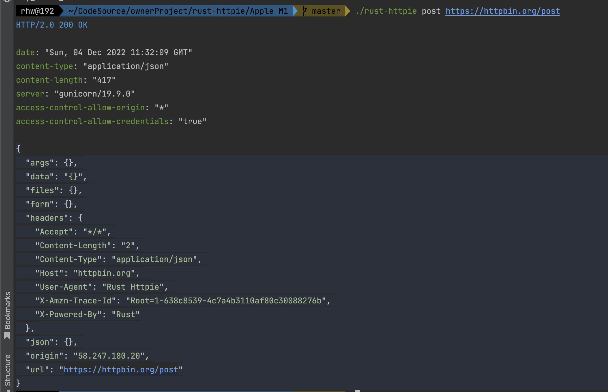

# rust-httpie

## rust 实现CLI小工具

 序号  | 语言     | 版本             | 
:----|:-------|:---------------
 1   | Rust   | 1.67.0-nightly |

下图是用 rust-httpie 发送了一个 post 请求的界面，你可以看到，相比 cURL，它在可用性上做了很多工作，包括对不同信息的语法高亮显示：

